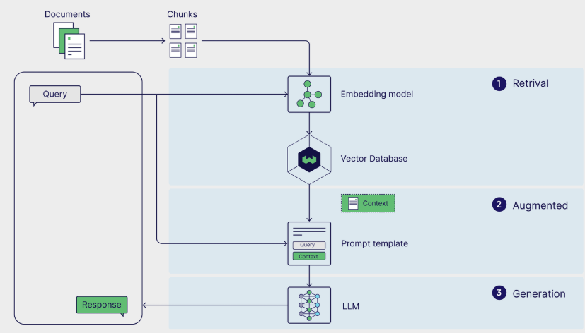
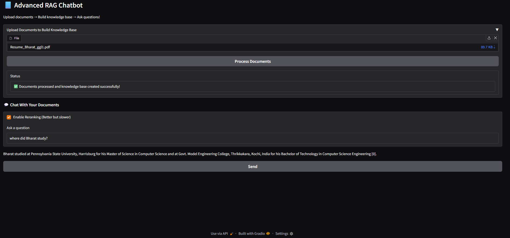

# Advanced RAG Document Chatbot

A modular **Retrieval-Augmented Generation (RAG)** application that lets you upload documents (PDF / DOCX / TXT), builds a FAISS vector index using OpenAI embeddings, and answers questions **grounded in your documents** with **inline citations**. Includes an optional **LLM-based reranking** toggle to improve retrieval quality.

---

## Features

- **Multi-document ingestion**: Upload multiple `.pdf`, `.docx`, and `.txt` files
- **Robust text extraction**: PDF (PyPDF), DOCX (python-docx), TXT
- **Token-aware chunking**: Uses `tiktoken` for more consistent chunk sizes
- **Vector search**: FAISS vector store via LangChain
- **Grounded answers with citations**: Responses include references like `[0]`, `[1]` from retrieved chunks
- **Optional reranking**: LLM reranks retrieved chunks for better relevance (slower but often improves answers)
- **Simple UI**: Gradio-based web app

---

## 🚀Setup

### 1) Clone the repo

```bash
git clone https://github.com/Bharat-Nandakumar/advanced-rag-document-chatbot.git
cd advanced-rag-document-chatbot
```

### 2) Install dependencies

```bash
pip install -r requirements.txt
```

### 3) Set environment variables

Create a .env file in the root directory and give OPENAI_API_KEY = "the key you have for openai".


### 4) Run the main file

```bash
python run.py
```

## 🧠 How It Works

1. Extract text from uploaded documents

2. Chunk text using token-based chunking (tiktoken)

3. Embed chunks using OpenAI embeddings

4. Index embeddings in a FAISS vector store

5. Retrieve top chunks for a query (with optional reranking)

6. Generate an answer using only retrieved context, returning citations like [0], [1].

### Reranking
The UI includes a checkbox:

 - ✅ Enable reranking: LLM reorders retrieved chunks by relevance

 - ❌ Disabled by default: Faster, cheaper

Reranking improves quality especially when:

 - documents are long

 - chunks are semantically similar

 - the query is ambiguous


## Architecture

The system follows a modular Retrieval-Augmented Generation (RAG) pipeline:

1. Document ingestion (PDF / DOCX / TXT)
2. Token-based chunking using `tiktoken`
3. Embedding generation via OpenAI Embeddings
4. Vector indexing using FAISS
5. Similarity-based retrieval
6. Optional LLM-based reranking
7. Context-grounded answer generation with citations

<p align="center">
  
</p>


## Results

The application provides a clean web-based interface for:

- Uploading multiple documents
- Building a knowledge base
- Asking contextual questions
- Viewing citation-grounded answers
- Enabling optional reranking for improved retrieval

Below is a screenshot of the frontend interface:

<p align="center">
  
</p>


## 📄 License

MIT License

## 👤 Author

Bharat Nandakumar
M.S. Computer Science
Penn State University – Harrisburg


